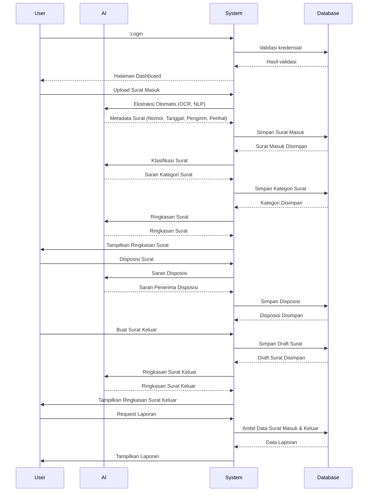
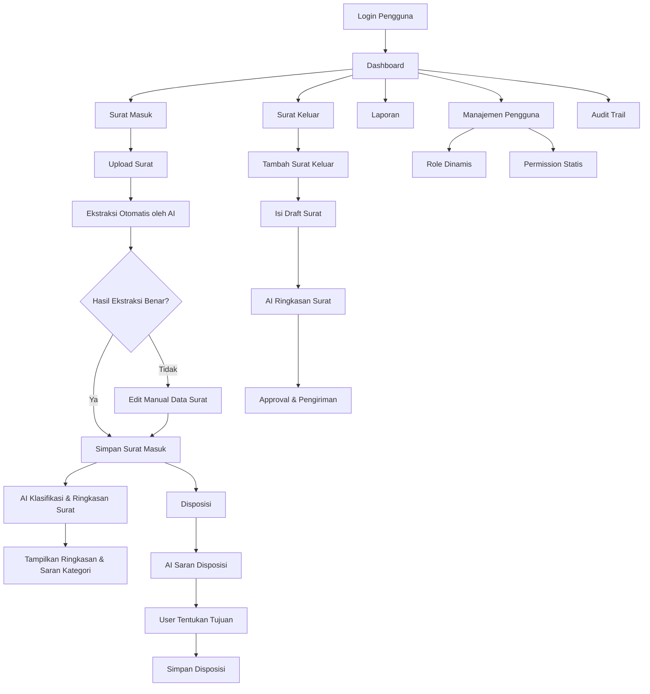

<div align="center">
    <a href="https://404notfound.fun" target="_blank">
        
    </a>
</div>

# Triton - Aplikasi Manajemen Surat

## Deskripsi Produk
Triton adalah aplikasi berbasis web untuk mengelola surat masuk dan keluar, dilengkapi dengan fitur AI untuk ekstraksi data otomatis, klasifikasi isi, ringkasan, dan saran disposisi. Aplikasi ini dibangun menggunakan Laravel di sisi backend dan Vue.js di sisi frontend.

## Tujuan
- Meningkatkan efisiensi dan akurasi dalam pengelolaan surat.
- Mengurangi beban input manual dengan bantuan AI.
- Menyediakan sistem manajemen disposisi yang terorganisir dan terdokumentasi.

## Fitur Utama

### 📥 Surat Masuk
- Upload dokumen (PDF, JPG, PNG).
- **Ekstraksi Otomatis oleh AI**: Isi metadata surat (nomor, tanggal, pengirim, perihal).
- **Klasifikasi Surat Otomatis**: AI menyarankan kategori surat.
- **Ringkasan Surat Otomatis**: Ditampilkan untuk pratinjau cepat.
- Disposisi manual atau otomatis dengan saran dari AI.
- Riwayat dan status surat terpantau.

### 📤 Surat Keluar
- Pembuatan draft dan unggah dokumen.
- Penomoran otomatis.
- Proses approval internal.
- **AI Ringkasan Surat** untuk efisiensi review.
- Arsip otomatis.

### 🔄 Disposisi
- Disposisi ke user/unit.
- AI memberikan **saran penerima disposisi** berdasarkan histori.
- Riwayat dan pelacakan proses.

### 📁 Kategori Surat
- Dikelola admin.
- AI menyarankan kategori saat input surat.

### 👤 Manajemen Pengguna
- CRUD pengguna dan pengaturan role.
- Role bersifat **dinamis** (bisa ditambah/ubah).
- Permission bersifat **statis**, digunakan di `Gate` Laravel.

### 🔐 Role & Permission
- Role dapat dikonfigurasi admin.
- Permission statis dan digunakan untuk kontrol akses (Gate di Laravel, directive di Vue).

### 🔍 Pencarian & Filter
- Pencarian berdasarkan metadata dan isi surat.
- Filter berdasarkan tanggal, kategori, status, dan unit tujuan.

### 🧾 Audit Trail
- Mencatat aktivitas penting: upload, edit, disposisi, approval, login, dll.

### 📊 Laporan
- Export PDF/Excel untuk surat masuk & keluar.
- Disertai filter berdasarkan waktu, kategori, status, dan unit.

## Fitur AI Detail

| Fitur AI                     | Penjelasan                                                                 |
|-----------------------------|----------------------------------------------------------------------------|
| **Ekstraksi Data Otomatis** | OCR + NLP untuk mengisi metadata surat secara otomatis.                    |
| **Klasifikasi Surat**        | AI menyarankan kategori surat berdasarkan konten.                         |
| **Ringkasan Surat**          | AI membuat ringkasan pendek isi surat untuk efisiensi pembacaan.           |
| **Saran Disposisi**          | Berdasarkan isi surat dan histori sebelumnya, AI menyarankan tujuan disposisi. |

## Alur Integrasi AI

1. **Saat Upload Surat Masuk**  
   → Jalankan proses ekstraksi → Klasifikasi → Ringkasan.

2. **Saat Disposisi Surat**  
   → AI menyarankan penerima berdasarkan isi dan histori.

3. **Saat Review Surat Keluar**  
   → Ringkasan AI membantu reviewer membaca cepat.

## Sequence Flow



### Penjelasan:
- **User** melakukan login ke aplikasi dan mengakses halaman **Dashboard** setelah kredensial tervalidasi.
- **User** meng-upload **Surat Masuk**, yang diproses oleh **AI** untuk ekstraksi metadata, klasifikasi, dan ringkasan surat.
- **System** menyimpan data surat dan kategori ke dalam **Database**.
- **User** dapat melakukan disposisi surat, dengan bantuan **AI** yang memberikan saran penerima disposisi.
- **User** dapat membuat **Surat Keluar**, yang juga akan diproses oleh **AI** untuk menghasilkan ringkasan surat.
- **User** dapat meminta laporan terkait surat masuk dan keluar, yang akan diambil dari **Database** dan ditampilkan oleh **System**.

Sequence diagram ini dapat dimasukkan ke dalam dokumentasi proyek di GitHub atau bagian lain sesuai kebutuhan.

## Flow Aplikasi (MermaidJS)



## 🛠️ Tech Stack

- **Laravel 12** – Backend API
- **Vue 3 + Vite** – Reactive frontend
- **Tailwind CSS** – Utility-first CSS framework
- **MySQL** – Relational database

## 📦 Installation

```bash
# Install PHP dependencies
composer install

# Copy environment file and generate app key
cp .env.example .env
php artisan key:generate
```

### 🔐 Environment Configuration

```
DB_DATABASE=your_db
DB_USERNAME=your_user
DB_PASSWORD=your_password
```

### ▶️ Finishing

```bash
# Run migrations
php artisan migrate --seed

# Install frontend dependencies
npm install
npm run dev
```

## 🧪 Development

```bash
php artisan serve
php artisan queue:work
npm run dev
```

## 📄 License

This project is proprietary software.  
© 2025 [404NotFoundIndonesia](https://github.com/404NotFoundIndonesia) – All rights reserved.  
Use of this software is governed by the [Triton Software License Agreement](LICENSE).

